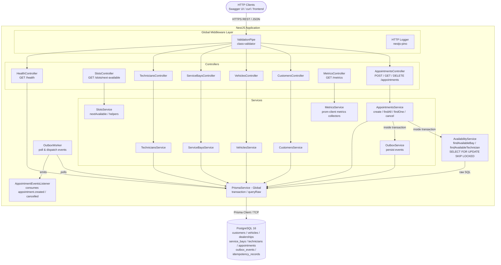
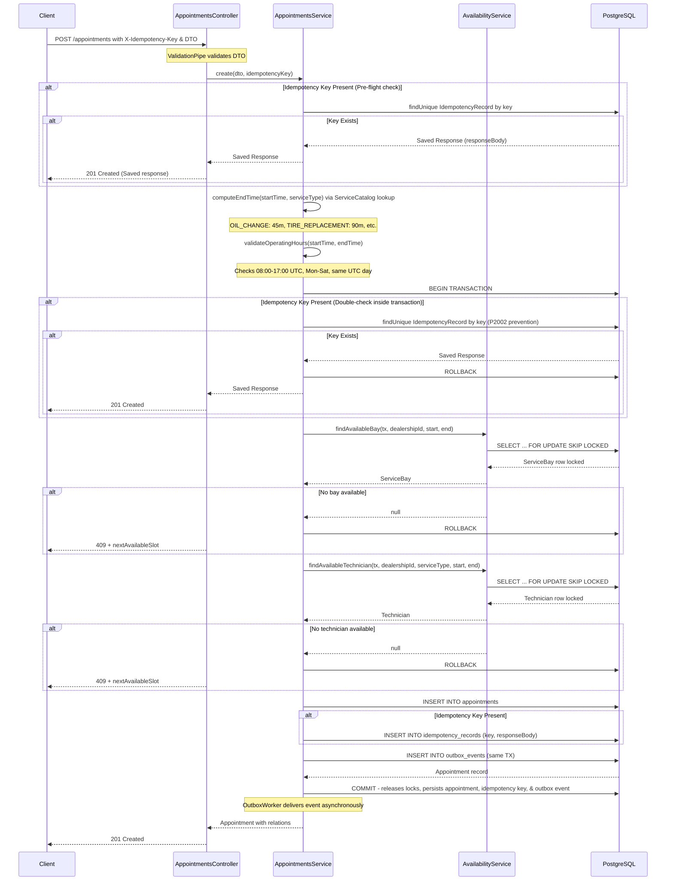
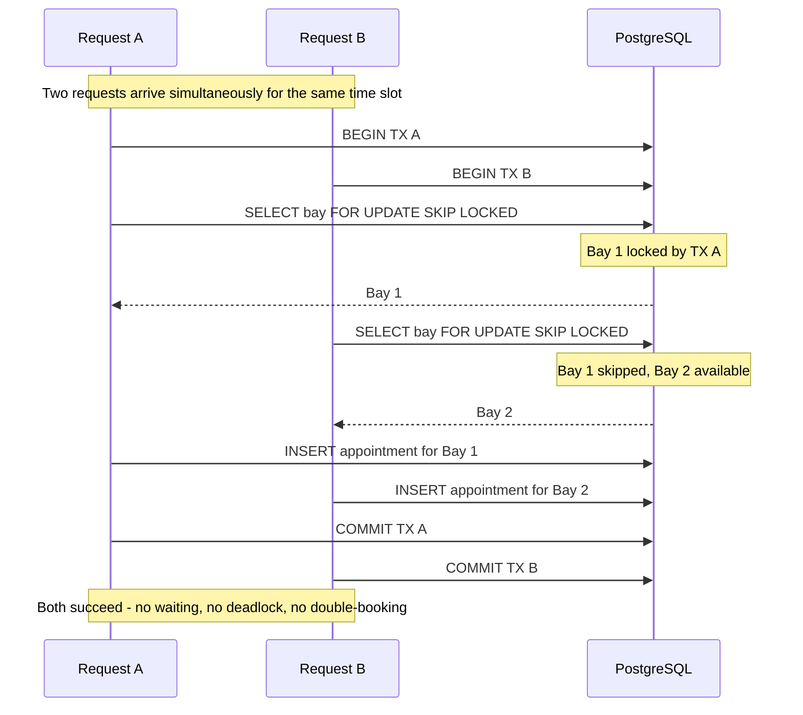

# System Design: Unified Service Scheduler

**Keyloop Technical Assessment — Scenario A**

---

## 1. Architecture Diagram



---

## 2. Component Roles

### AppointmentsController

Exposes the core booking endpoints: `POST /appointments` (create), `GET /appointments` (list with filters), `GET /appointments/:id` (single), `DELETE /appointments/:id` (cancel). Delegates all logic to `AppointmentsService` — the controller is intentionally thin, handling only HTTP concerns (status codes, response shaping).

### AppointmentsService

Orchestrates the entire booking transaction. On `create()`, it computes the appointment end time via `AvailabilityService`, opens a Prisma `$transaction`, and calls both availability lookups inside it. If either resource is unavailable, it throws a custom `BookingConflictException (409)` containing the next available slot, rolling back the transaction. Inside the same transaction, it writes a domain event to the `outbox_events` table (Transactional Outbox). On `cancel()` and `updateStatus()`, it uses **optimistic locking** via `updateMany + updatedAt` to prevent concurrent modifications from generating duplicate events. `findAll()` supports both **offset pagination** and **cursor-based pagination** (using `(startTime, id)` as the seek key, O(1) at any depth).

### AvailabilityService

The concurrency-critical component. Contains two methods — `findAvailableBay()` and `findAvailableTechnician()` — each issuing a raw SQL query with `SELECT ... FOR UPDATE SKIP LOCKED` against the database. These methods must be called inside a Prisma `$transaction`; the lock is held for the duration of the transaction, preventing any concurrent request from claiming the same resource.

### CRUD Modules (Customers, Vehicles, ServiceBays, Technicians)

Standard NestJS modules providing `POST`, `GET`, `GET/:id`, `DELETE` for their respective entities. They serve as the setup/management layer — allowing a dealership admin to register bays, onboard technicians, and manage customer records before the booking flow runs.

### PrismaService

A global singleton that wraps `PrismaClient`. Handles connection lifecycle (`onModuleInit` / `onModuleDestroy`). Exposes `$transaction` for ACID-safe multi-step operations and `$queryRaw` for the locking queries that Prisma's query builder cannot express directly.

### OutboxModule

- **OutboxService**: writes domain events into the `outbox_events` table inside the same Prisma transaction as the business write. Ensures event and appointment are committed or rolled back atomically.
- **OutboxWorker**: polls `outbox_events` every 500ms using `SELECT ... FOR UPDATE SKIP LOCKED`. Dispatches events to the in-process EventEmitter2. Multiple service instances never double-deliver thanks to the skip-locked pattern. The `dispatch()` method acts as a clean boundary for migrating to a real message broker (RabbitMQ, Kafka, SQS).

### HealthModule

Exposes `GET /health` using `@nestjs/terminus`. Runs a `SELECT 1` against PostgreSQL to verify the database connection is live. Returns `{ status: 'ok' }` on success or `{ status: 'error' }` with a `503` on failure. Used by container orchestrators (Docker health check, Kubernetes liveness probe) to determine whether the service is ready to serve traffic.

### Global Middleware Layer

- **ValidationPipe**: enforces DTO schemas on every incoming request using `class-validator`. Rejects requests with unknown fields (`forbidNonWhitelisted: true`) and auto-transforms primitive types (`transform: true`). Returns `400 Bad Request` on failure.
- **nestjs-pino**: replaces the default NestJS logger with a high-performance structured JSON logger. Every HTTP request/response is automatically logged with method, URL, status, and response time.

---

## 3. Data Flow

### Booking a New Appointment (Happy Path)



### Conflict Response — Enriched 409

When a conflict occurs (i.e., no bay or technician is available), the service calls `SlotsService.findNextAvailable()` and embeds the result in the 409 response:

```json
{
  "statusCode": 409,
  "message": "No service bay available for the requested time slot",
  "nextAvailableSlot": {
    "startTime": "2026-07-01T10:00:00.000Z",
    "endTime": "2026-07-01T11:00:00.000Z"
  }
}
```

This reduces frontend complexity by avoiding an additional slot discovery request.

### Concurrent Booking - SKIP LOCKED in Action



Both requests complete without waiting for each other. No deadlock. No double booking.

### Time Overlap Check

An existing appointment **blocks** a new request if:

```
existing.start_time < requested.end_time
AND existing.end_time   > requested.start_time
```

This covers all overlap cases: full overlap, partial start overlap, partial end overlap, and exact containment. Back-to-back slots (e.g. 09:00–10:00 and 10:00–11:00) evaluate to `false` and do **not** block each other.

---

## 4. Technology Stack & Justifications

| Technology | Role | Justification |
| --- | --- | --- |
| **NestJS** | Application framework | Opinionated, modular architecture with built-in dependency injection. Decorators map naturally to REST concepts. Enforces consistent structure across a growing codebase. First-class TypeScript support. |
| **TypeScript** | Language | Catches type errors at compile time. DTOs and Prisma-generated types give end-to-end type safety from HTTP request to database query — no silent `undefined` bugs. |
| **PostgreSQL 16** | Primary database | `SELECT FOR UPDATE SKIP LOCKED` is a native PostgreSQL feature, making it the correct choice for this concurrency pattern. Supports `text[]` arrays (used for `technician.specializations`) and partial indexes. ACID guarantees for the booking transaction. |
| **Prisma ORM** | Database client | Type-safe query builder generated from the schema. `$transaction` provides a clean API for wrapping multi-step operations. `$queryRaw` allows falling back to raw SQL when the query builder cannot express locking semantics. Schema-first migrations. |
| **class-validator + class-transformer** | DTO validation | Declarative validation via decorators on DTO classes — no hand-written validation logic. Integrates directly with NestJS `ValidationPipe`. |
| **@nestjs/swagger** | API documentation | Generates interactive OpenAPI docs from decorators already present on controllers and DTOs. Zero maintenance cost — docs update when code updates. |
| **nestjs-pino** | Structured logging | Pino is the fastest Node.js JSON logger. Structured logs (JSON objects rather than interpolated strings) are directly ingestible by log aggregators (Datadog, CloudWatch, ELK). |
| **@nestjs/throttler** | Rate limiting | Protects endpoints from abusive clients and ensures predictable resource usage by returning `429 Too Many Requests` when limits are exceeded. |
| **prom-client** | Metrics collection | Prometheus-compatible metrics exposition used by `MetricsModule` to expose `GET /metrics`. |
| **@nestjs/event-emitter** | Domain events | Lightweight in-process event emitter used to publish `appointment.*` events for decoupled side-effects (notifications, analytics). |
| **OpenTelemetry** | Tracing | Distributed tracing instrumentation to trace the critical path (`POST /appointments`) across DB and internal services. |
| **@nestjs/terminus** | Health checks | Standard health check library for NestJS. Provides the `GET /health` endpoint used by container orchestrators to probe readiness. |
| **Jest + ts-jest** | Unit testing | Standard testing framework for Node.js. `ts-jest` allows tests to run directly against TypeScript source without a separate compile step. |
| **Docker + docker-compose** | Container runtime | Provides a reproducible environment. `docker-compose` brings up PostgreSQL for local development with a single command. |

---

## 5. Observability Strategy

### Logging

All HTTP requests and application events are logged as structured JSON using **nestjs-pino**:

- **HTTP layer**: every request and response is automatically captured (method, URL, status code, response time, request ID).
- **Service layer**: key business events are explicitly logged using NestJS `Logger` (which is backed by pino in production):

```typescript
// On appointment creation attempt
this.logger.log({ msg: 'Attempting to create appointment', dealershipId, serviceType, startTime, endTime });

// On resource unavailable
this.logger.warn({ msg: 'No available service bay', dealershipId, startTime, endTime });

// On success
this.logger.log({ msg: 'appointment.created', appointmentId, technicianId, serviceBayId });
```

Structured objects (not interpolated strings) enable log-level filtering and field-based querying in any log aggregator without parsing.

In **development**, `pino-pretty` formats logs for human readability. In **production** (`NODE_ENV=production`), raw JSON is emitted directly — no formatting overhead, ready for ingestion by Datadog, CloudWatch, or the ELK stack.

### Health Checks

`GET /health` runs a `SELECT 1` against the database and returns:

```json
// Healthy
{ "status": "ok", "info": { "database": { "status": "up" } } }

// Degraded
{ "status": "error", "error": { "database": { "status": "down", "message": "..." } }, "statusCode": 503 }
```

This endpoint is designed to be polled by container orchestrators (Docker health check, Kubernetes liveness/readiness probes) to automatically restart or remove unhealthy instances.

### Metrics (Implemented)

Metrics are implemented in this assessment via `prom-client` and exposed at `GET /metrics`:

- `appointment_bookings_total` (labels: outcome=created|conflict_bay|conflict_tech|cancelled)
- `http_request_duration_ms` (histogram by route/method)
- Node.js runtime metrics (heap, event loop lag)

Scrape with Prometheus and visualize with Grafana.

### Tracing (Implemented)

Basic tracing is implemented using **OpenTelemetry** instrumentation. Traces propagate through the HTTP layer and the Prisma DB calls, and spans are exported to the configured OTLP exporter (Jaeger/Datadog). This gives end-to-end visibility into `POST /appointments` and helps diagnose latency caused by lock acquisition or DB contention.

### Correlation IDs

`pino-http` assigns a unique `req.id` to every HTTP request and includes it in all log entries for that request. In production, this would be extended to read `X-Request-Id` from upstream load balancers, ensuring logs across services can be correlated by a single ID.

---

## 6. Production Readiness Decisions

This section documents deliberate design choices made to ensure the system is ready for real production load — not just the acceptance criteria. Each decision addresses a specific failure mode that only appears at scale or in edge cases.

### Transactional Outbox Pattern

**Problem without it:** Emitting domain events directly after a database commit is vulnerable to crashes. If the process dies between the database commit and the event emission, the system enters an inconsistent state (the booking exists but downstream consumers like notifications are never notified).

**Decision:** Persist events into the `outbox_events` table inside the same transaction as the booking write. A background worker polls the table using `SELECT FOR UPDATE SKIP LOCKED` and dispatches the events, guaranteeing at-least-once delivery with crash safety.

### Pagination on `GET /appointments`

**Problem without it:** A dealership with three years of history has hundreds of thousands of appointment records. A single `findMany` with no limit would load all of them into memory, serialize the entire result set to JSON, and either crash the server or time out the client. Additionally, standard offset pagination (`OFFSET 980`) requires PostgreSQL to scan and discard rows, leading to O(N) degradation at deep page queries.

**Decision:** Implemented two modes of pagination:
1. **Offset Pagination** (default): returns `{ data, total, page, limit }` allowing random page access for dashboards.
2. **Cursor Pagination** (`?cursor=<opaque_token>`): performs O(1) index seeks using `(startTime, id)` as the seek key, yielding high performance even at extreme page depths.

### Database Indexes on the `appointments` Table

**Problem without them:** The availability query inside every booking transaction runs a subquery against `appointments` filtered by `service_bay_id`, `technician_id`, `start_time`, and `end_time`. Without indexes, PostgreSQL performs a full sequential scan of the table on every booking request. At 1 million rows this scan takes hundreds of milliseconds and locks the table longer — directly increasing contention under load.

**Decision:** Four indexes placed on the exact column combinations used by the availability subqueries:

```prisma
@@index([serviceBayId, startTime, endTime])   // availability check for bays
@@index([technicianId, startTime, endTime])   // availability check for technicians
@@index([dealershipId, startTime])            // list by dealership+date (common dashboard query)
@@index([customerId])                         // list appointments by customer
```

These are partial in intent — they mirror the WHERE clauses in `AvailabilityService` exactly, so PostgreSQL can use index-only scans rather than heap fetches.

### Past-Date Validation

**Problem without it:** A client can submit `desiredStartTime: "2020-01-01T09:00:00Z"`. The system would find a free bay (nothing is booked 5 years ago), create an appointment, and commit it. The record is immediately in a logically invalid state — the appointment is "CONFIRMED" for a time that has already passed.

**Decision:** `create()` rejects any `desiredStartTime` that is not strictly in the future before the transaction opens. This is a business rule, not a format rule — validated in the service layer, not the DTO, because it depends on runtime state (`new Date()`).

```typescript
if (startTime <= new Date()) {
  throw new BadRequestException('Appointment start time must be in the future');
}
```

### Concurrency: `SELECT FOR UPDATE SKIP LOCKED`

**Problem without it:** Two HTTP requests arriving within milliseconds for the same bay and time slot both read "bay is free", both pass the availability check, and both insert an appointment for the same bay — double booking.

**Decision:** Both availability queries run inside a single `$transaction` with `FOR UPDATE SKIP LOCKED` on the resource rows. The first transaction to acquire the lock proceeds; the second skips the locked row and either claims a different resource or returns 409 immediately — no waiting, no deadlock.

This is the only pattern that solves the double-booking problem at the database level without introducing an external dependency (Redis, distributed mutex) or a retry loop (optimistic locking).

### Idempotency via PostgreSQL

**Problem without it:** Under network jitter or client retries (e.g. after HTTP timeouts), identical request payloads can be sent multiple times. If not handled, this creates duplicate bookings (double booking), filling up bays and technicians with phantom appointments.

**Decision:** We implement a lightweight idempotency pattern using PostgreSQL instead of an external cache (like Redis). We introduced the `IdempotencyRecord` table (containing `key`, `responseBody`, `statusCode`, and `createdAt`).
1. **Pre-transaction check:** When an `X-Idempotency-Key` header is present, we check the `IdempotencyRecord` table first. If a match is found, we immediately parse and return the cached response without running resource checks.
2. **Atomic persist:** If the key is new, we proceed with booking checks and resource locking. When the appointment is successfully written, the `IdempotencyRecord` is created **inside the same database transaction** alongside the appointment and outbox event.
3. **P2002 Concurrency Prevention:** Under extreme concurrency where the same idempotency key is submitted simultaneously, the database's unique constraint on `key` will raise a P2002 conflict error. We catch this, perform a final query to load the successfully saved response, and return it safely.

This achieves robust, infrastructure-free idempotency with zero dependency on external caches, maintaining the ACID guarantees of the transactional flow.

### Service Catalog

**Problem without it:** Hardcoding service durations (e.g., assuming every appointment is exactly "60 minutes") restricts flexibility. Different service types (such as `OIL_CHANGE` vs. `TIRE_REPLACEMENT` or `BRAKE_REPAIR`) have different resource usage curves.

**Decision:** We introduced a static dictionary/enum `ServiceCatalog` defining explicit service durations in minutes (e.g., `OIL_CHANGE: 45`, `TIRE_REPLACEMENT: 90`). The calculated `endTime` is calculated dynamically from the `desiredStartTime` and the looked-up duration, enabling a clean way to support variable service lengths.

### Domain-Specific Validations (Operating Hours & Timezone)

**Problem without it:** Booking systems must respect real-world dealership schedules. A user could request a booking at 3 AM or on a Sunday, which would pass the resource checks (since no technicians or bays are occupied at that hour), resulting in a logically invalid appointment.

**Decision:** Added a strict validation step in `AppointmentsService.create()` that enforces the following domain rules:
1. **UTC Timezone Boundary:** All dates are treated as UTC.
2. **Operating Hours:** The requested `startTime` and calculated `endTime` must fall between `08:00` and `17:00` UTC.
3. **Operating Days:** The appointment must be scheduled between Monday and Saturday (dealerships are closed on Sundays).
4. **Single-Day Span:** An appointment must start and end on the same UTC day (no multi-day or overnight appointments).

### Rate limiting

The application enforces rate limiting using `@nestjs/throttler`. In production the default limits are tightened per-route (e.g., lower limits on `POST /appointments`) to protect backend resources; exceeding the rate returns `429 Too Many Requests` with an optional `Retry-After` header.

### Type-Safe Query Filters

**Problem without it:** `const where: any = {}` compiles successfully even if a field name is misspelled or a Prisma schema field is renamed during refactoring. The bug only surfaces at runtime.

**Decision:** `Prisma.AppointmentWhereInput` is used instead of `any`. TypeScript catches mismatched field names at compile time, meaning a schema rename triggers a compiler error on every query that references the old field name.


### Optimistic Locking on cancellations and status updates

**Problem without it:** Under concurrent status update or cancellation requests, a classical read-then-write sequence might suffer from TOCTOU (Time-of-Check, Time-of-Use) issues. Multiple requests could pass status validation guards concurrently, execute updates twice, and emit duplicate events.

**Decision:** We use Prisma's `updateMany` filtering on `id` and the `updatedAt` version token. If `count === 0`, it signifies another request modified the appointment in the meantime, and we throw a ConflictException, preventing duplicate event delivery.

---

## 7. GenAI Collaboration in the Design Phase

### Principle: Design First, Delegate Second

My approach to using AI in the design phase was to define the architecture, data models, and concurrency strategy independently, and then use AI as a sounding board to validate constraints and explore architectural trade-offs.

### Brainstorming Concurrency Strategies

Before finalizing the architecture, I identified double-booking under concurrent load as the hardest problem. I researched three patterns and discussed their trade-offs with AI:
1. **Optimistic Locking with Retries**: AI suggested this initially. I rejected it because retry loops in a high-contention booking scenario can lead to retry storms and degraded performance.
2. **Application-level Mutex (Redis)**: AI strongly recommended adding a Redis container for distributed locks. I rejected this to avoid over-engineering and infrastructure bloat.
3. **Pessimistic Locking (`SKIP LOCKED`)**: I proposed using PostgreSQL's native `SELECT FOR UPDATE SKIP LOCKED`. I worked with the AI to verify its exact semantics—confirming that it is non-blocking, avoids deadlocks, and releases locks automatically on commit/rollback. We concluded this was the optimal design.

### Validating the Data Model

I collaborated with the AI to refine the relational schema prior to implementation.
- **Service Types & Specializations:** The AI initially proposed a many-to-many join table for technician specializations. I rejected this during design to avoid unnecessary query-time joins, opting instead for a `text[]` array column, enabling `serviceType = ANY(specializations)`.
- **Idempotency Strategy:** We debated how to store idempotency keys. The AI suggested an external cache. I designed a schema using a dedicated `idempotency_records` table within PostgreSQL to ensure atomicity with the main booking transaction.
- **Transactional Outbox:** I designed the `outbox_events` table and verified with the AI that polling it via `SKIP LOCKED` would guarantee at-least-once delivery without double-publishing in a multi-instance deployment.

### Defining the API Contract & Pagination

- **Pagination:** For `GET /appointments`, the AI defaulted to offset-based pagination (`page` and `limit`). I recognized that this would degrade to O(N) performance at scale. During the API design phase, I directed the inclusion of a `nextCursor` property to support O(1) Cursor-Based Pagination for deep seeks.
- **Conflict Resolution (Enriched 409):** We designed the `409 Conflict` response to not just fail, but to proactively return the `nextAvailableSlot`, reducing round-trips for the client frontend.

> **Note:** For details on how AI was guided during the *implementation and coding phase* (including bug catching, test verification, and quality assurance), please refer to the **AI Collaboration Narrative** in the `README.md`.
