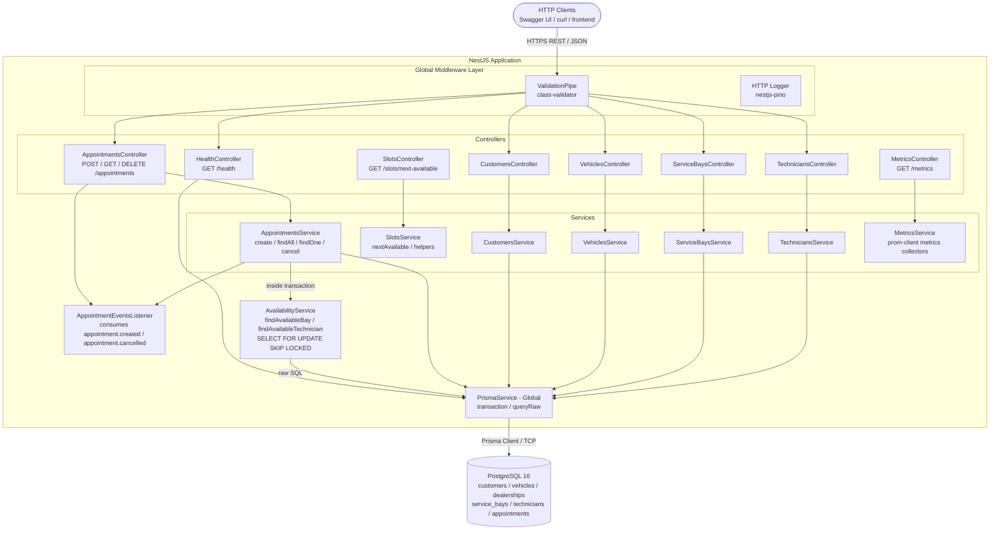
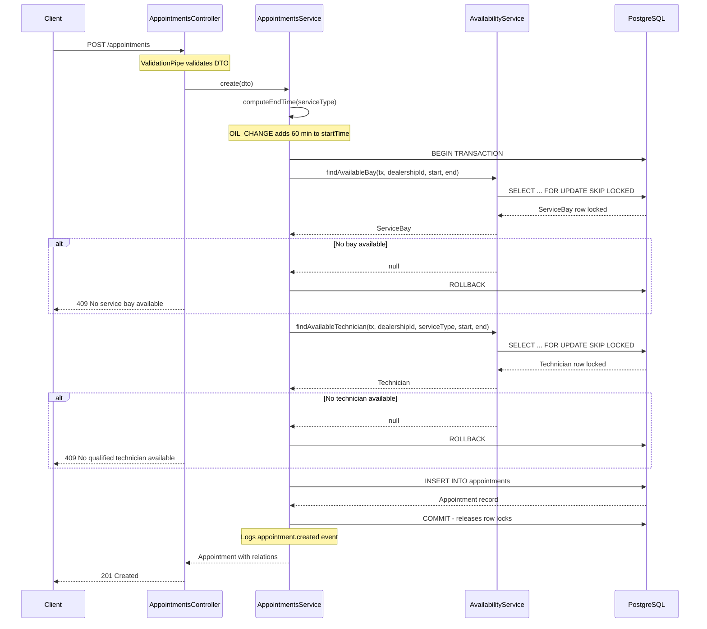
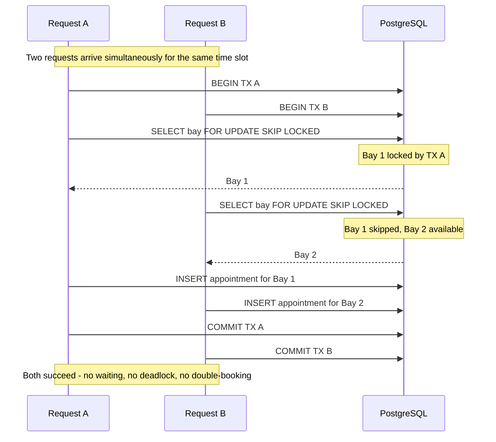

# System Design: Unified Service Scheduler

**Keyloop Technical Assessment — Scenario A**

---

## 1. Architecture Diagram



---

## 2. Component Roles

### AppointmentsController

Exposes the core booking endpoints: `POST /appointments` (create), `GET /appointments` (list with filters), `GET /appointments/:id` (single), `DELETE /appointments/:id` (cancel). Delegates all logic to `AppointmentsService` — the controller is intentionally thin, handling only HTTP concerns (status codes, response shaping).

### AppointmentsService

Orchestrates the entire booking transaction. On `create()`, it computes the appointment end time via `AvailabilityService`, opens a Prisma `$transaction`, and calls both availability lookups inside it. If either resource is unavailable, it throws a `ConflictException (409)` and the transaction rolls back. On `cancel()`, it validates the current status before updating to `CANCELLED`.

### AvailabilityService

The concurrency-critical component. Contains two methods — `findAvailableBay()` and `findAvailableTechnician()` — each issuing a raw SQL query with `SELECT ... FOR UPDATE SKIP LOCKED` against the database. These methods must be called inside a Prisma `$transaction`; the lock is held for the duration of the transaction, preventing any concurrent request from claiming the same resource.

### CRUD Modules (Customers, Vehicles, ServiceBays, Technicians)

Standard NestJS modules providing `POST`, `GET`, `GET/:id`, `DELETE` for their respective entities. They serve as the setup/management layer — allowing a dealership admin to register bays, onboard technicians, and manage customer records before the booking flow runs.

### PrismaService

A global singleton that wraps `PrismaClient`. Handles connection lifecycle (`onModuleInit` / `onModuleDestroy`). Exposes `$transaction` for ACID-safe multi-step operations and `$queryRaw` for the locking queries that Prisma's query builder cannot express directly.

### HealthModule

Exposes `GET /health` using `@nestjs/terminus`. Runs a `SELECT 1` against PostgreSQL to verify the database connection is live. Returns `{ status: 'ok' }` on success or `{ status: 'error' }` with a `503` on failure. Used by container orchestrators (Docker health check, Kubernetes liveness probe) to determine whether the service is ready to serve traffic.

### Global Middleware Layer

- **ValidationPipe**: enforces DTO schemas on every incoming request using `class-validator`. Rejects requests with unknown fields (`forbidNonWhitelisted: true`) and auto-transforms primitive types (`transform: true`). Returns `400 Bad Request` on failure.
- **nestjs-pino**: replaces the default NestJS logger with a high-performance structured JSON logger. Every HTTP request/response is automatically logged with method, URL, status, and response time.

---

## 3. Data Flow

### Booking a New Appointment (Happy Path)



### Concurrent Booking - SKIP LOCKED in Action



Both requests complete without waiting for each other. No deadlock. No double booking.

### Time Overlap Check

An existing appointment **blocks** a new request if:

```
existing.start_time < requested.end_time
AND existing.end_time   > requested.start_time
```

This covers all overlap cases: full overlap, partial start overlap, partial end overlap, and exact containment. Back-to-back slots (e.g. 09:00–10:00 and 10:00–11:00) evaluate to `false` and do **not** block each other.

---

## 4. Technology Stack & Justifications

| Technology | Role | Justification |
| --- | --- | --- |
| **NestJS** | Application framework | Opinionated, modular architecture with built-in dependency injection. Decorators map naturally to REST concepts. Enforces consistent structure across a growing codebase. First-class TypeScript support. |
| **TypeScript** | Language | Catches type errors at compile time. DTOs and Prisma-generated types give end-to-end type safety from HTTP request to database query — no silent `undefined` bugs. |
| **PostgreSQL 16** | Primary database | `SELECT FOR UPDATE SKIP LOCKED` is a native PostgreSQL feature, making it the correct choice for this concurrency pattern. Supports `text[]` arrays (used for `technician.specializations`) and partial indexes. ACID guarantees for the booking transaction. |
| **Prisma ORM** | Database client | Type-safe query builder generated from the schema. `$transaction` provides a clean API for wrapping multi-step operations. `$queryRaw` allows falling back to raw SQL when the query builder cannot express locking semantics. Schema-first migrations. |
| **class-validator + class-transformer** | DTO validation | Declarative validation via decorators on DTO classes — no hand-written validation logic. Integrates directly with NestJS `ValidationPipe`. |
| **@nestjs/swagger** | API documentation | Generates interactive OpenAPI docs from decorators already present on controllers and DTOs. Zero maintenance cost — docs update when code updates. |
| **nestjs-pino** | Structured logging | Pino is the fastest Node.js JSON logger. Structured logs (JSON objects rather than interpolated strings) are directly ingestible by log aggregators (Datadog, CloudWatch, ELK). |
| **@nestjs/throttler** | Rate limiting | Protects endpoints from abusive clients and ensures predictable resource usage by returning `429 Too Many Requests` when limits are exceeded. |
| **prom-client** | Metrics collection | Prometheus-compatible metrics exposition used by `MetricsModule` to expose `GET /metrics`. |
| **@nestjs/event-emitter** | Domain events | Lightweight in-process event emitter used to publish `appointment.*` events for decoupled side-effects (notifications, analytics). |
| **OpenTelemetry** | Tracing | Distributed tracing instrumentation to trace the critical path (`POST /appointments`) across DB and internal services. |
| **@nestjs/terminus** | Health checks | Standard health check library for NestJS. Provides the `GET /health` endpoint used by container orchestrators to probe readiness. |
| **Jest + ts-jest** | Unit testing | Standard testing framework for Node.js. `ts-jest` allows tests to run directly against TypeScript source without a separate compile step. |
| **Docker + docker-compose** | Container runtime | Provides a reproducible environment. `docker-compose` brings up PostgreSQL for local development with a single command. |

---

## 5. Observability Strategy

### Logging

All HTTP requests and application events are logged as structured JSON using **nestjs-pino**:

- **HTTP layer**: every request and response is automatically captured (method, URL, status code, response time, request ID).
- **Service layer**: key business events are explicitly logged using NestJS `Logger` (which is backed by pino in production):

```typescript
// On appointment creation attempt
this.logger.log({ msg: 'Attempting to create appointment', dealershipId, serviceType, startTime, endTime });

// On resource unavailable
this.logger.warn({ msg: 'No available service bay', dealershipId, startTime, endTime });

// On success
this.logger.log({ msg: 'appointment.created', appointmentId, technicianId, serviceBayId });
```

Structured objects (not interpolated strings) enable log-level filtering and field-based querying in any log aggregator without parsing.

In **development**, `pino-pretty` formats logs for human readability. In **production** (`NODE_ENV=production`), raw JSON is emitted directly — no formatting overhead, ready for ingestion by Datadog, CloudWatch, or the ELK stack.

### Health Checks

`GET /health` runs a `SELECT 1` against the database and returns:

```json
// Healthy
{ "status": "ok", "info": { "database": { "status": "up" } } }

// Degraded
{ "status": "error", "error": { "database": { "status": "down", "message": "..." } }, "statusCode": 503 }
```

This endpoint is designed to be polled by container orchestrators (Docker health check, Kubernetes liveness/readiness probes) to automatically restart or remove unhealthy instances.

### Metrics (Implemented)

Metrics are implemented in this assessment via `prom-client` and exposed at `GET /metrics`:

- `appointment_bookings_total` (labels: outcome=created|conflict_bay|conflict_tech|cancelled)
- `http_request_duration_ms` (histogram by route/method)
- Node.js runtime metrics (heap, event loop lag)

Scrape with Prometheus and visualize with Grafana.

### Tracing (Implemented)

Basic tracing is implemented using **OpenTelemetry** instrumentation. Traces propagate through the HTTP layer and the Prisma DB calls, and spans are exported to the configured OTLP exporter (Jaeger/Datadog). This gives end-to-end visibility into `POST /appointments` and helps diagnose latency caused by lock acquisition or DB contention.

### Correlation IDs

`pino-http` assigns a unique `req.id` to every HTTP request and includes it in all log entries for that request. In production, this would be extended to read `X-Request-Id` from upstream load balancers, ensuring logs across services can be correlated by a single ID.

---

## 6. Production Readiness Decisions

This section documents deliberate design choices made to ensure the system is ready for real production load — not just the acceptance criteria. Each decision addresses a specific failure mode that only appears at scale or in edge cases.

### Pagination on `GET /appointments`

**Problem without it:** A dealership with three years of history has hundreds of thousands of appointment records. A single `findMany` with no limit would load all of them into memory, serialize the entire result set to JSON, and either crash the server or time out the client.

**Decision:** All list endpoints return a paginated envelope `{ data, total, page, limit }` with a default of 20 records per page and a hard cap of 100.

```json
{ "data": [...], "total": 4821, "page": 2, "limit": 20 }
```

The `total` field allows the client to calculate page count without a second request. The hard cap prevents a client passing `limit=999999` and bypassing the guard.

### Database Indexes on the `appointments` Table

**Problem without them:** The availability query inside every booking transaction runs a subquery against `appointments` filtered by `service_bay_id`, `technician_id`, `start_time`, and `end_time`. Without indexes, PostgreSQL performs a full sequential scan of the table on every booking request. At 1 million rows this scan takes hundreds of milliseconds and locks the table longer — directly increasing contention under load.

**Decision:** Four indexes placed on the exact column combinations used by the availability subqueries:

```prisma
@@index([serviceBayId, startTime, endTime])   // availability check for bays
@@index([technicianId, startTime, endTime])   // availability check for technicians
@@index([dealershipId, startTime])            // list by dealership+date (common dashboard query)
@@index([customerId])                         // list appointments by customer
```

These are partial in intent — they mirror the WHERE clauses in `AvailabilityService` exactly, so PostgreSQL can use index-only scans rather than heap fetches.

### Past-Date Validation

**Problem without it:** A client can submit `desiredStartTime: "2020-01-01T09:00:00Z"`. The system would find a free bay (nothing is booked 5 years ago), create an appointment, and commit it. The record is immediately in a logically invalid state — the appointment is "CONFIRMED" for a time that has already passed.

**Decision:** `create()` rejects any `desiredStartTime` that is not strictly in the future before the transaction opens. This is a business rule, not a format rule — validated in the service layer, not the DTO, because it depends on runtime state (`new Date()`).

```typescript
if (startTime <= new Date()) {
  throw new BadRequestException('Appointment start time must be in the future');
}
```

### Concurrency: `SELECT FOR UPDATE SKIP LOCKED`

**Problem without it:** Two HTTP requests arriving within milliseconds for the same bay and time slot both read "bay is free", both pass the availability check, and both insert an appointment for the same bay — double booking.

**Decision:** Both availability queries run inside a single `$transaction` with `FOR UPDATE SKIP LOCKED` on the resource rows. The first transaction to acquire the lock proceeds; the second skips the locked row and either claims a different resource or returns 409 immediately — no waiting, no deadlock.

This is the only pattern that solves the double-booking problem at the database level without introducing an external dependency (Redis, distributed mutex) or a retry loop (optimistic locking).

### Idempotency on create

`POST /appointments` supports an `X-Idempotency-Key` header. Clients are strongly encouraged to send a stable idempotency key when retrying create operations (for example on network timeouts). The server stores the recent idempotency keys for a short TTL and returns the same result for identical requests bearing the same key.

### Rate limiting

The application enforces rate limiting using `@nestjs/throttler`. In production the default limits are tightened per-route (e.g., lower limits on `POST /appointments`) to protect backend resources; exceeding the rate returns `429 Too Many Requests` with an optional `Retry-After` header.

### Type-Safe Query Filters

**Problem without it:** `const where: any = {}` compiles successfully even if a field name is misspelled or a Prisma schema field is renamed during refactoring. The bug only surfaces at runtime.

**Decision:** `Prisma.AppointmentWhereInput` is used instead of `any`. TypeScript catches mismatched field names at compile time, meaning a schema rename triggers a compiler error on every query that references the old field name.

---

## 7. GenAI Collaboration in the Design Phase

### Principle: Design First, Delegate Second

My approach was to arrive at every significant decision independently before involving AI. Claude (Anthropic) was used as an implementation accelerator — not as an architect. The architecture, the concurrency strategy, the data model shape, and the API contract were all defined by me before AI generated a single line of code.

### Phase 1: Problem Framing (Me)

Before opening any AI tool, I decomposed the problem into its hard constraints:

- A booking is only valid if **both** a bay and a technician are free for the **entire** service duration simultaneously.
- Under concurrent HTTP requests, two users could read "bay available" at the same instant and both attempt to claim it — a classic read-then-write race condition.
- The solution must be atomic, require no external infrastructure, and degrade gracefully (return 409, not corrupt data).

I identified `SELECT FOR UPDATE SKIP LOCKED` inside a database transaction as the correct pattern from prior knowledge of PostgreSQL concurrency primitives. I then read the PostgreSQL 16 documentation to verify the exact semantics: that `SKIP LOCKED` is non-blocking (it does not wait on locked rows), cannot deadlock, and releases locks at transaction commit — exactly the behavior needed.

### Phase 2: Architecture Definition (Me, validated by AI)

I defined the module boundary before scaffolding:

- `AvailabilityService` owns the locking SQL and must be called **inside** the transaction, not before it.
- `AppointmentsService` owns the transaction boundary — not the controller.
- CRUD modules (Customers, Vehicles, etc.) are isolated from booking logic.

I asked Claude to critique this boundary. It confirmed the design was sound and flagged that passing the transaction client (`tx`) into `AvailabilityService` would require a `tx as any` cast due to a Prisma TypeScript limitation — a nuance I verified by reading the Prisma source type definitions.

**Data model — I rejected AI's first proposal.** Claude's initial schema draft used a join table for technician specializations. I rejected this: a join table adds a query-time join for a field that never needs independent querying. I directed Claude to use a PostgreSQL `text[]` array instead, enabling `serviceType = ANY(specializations)` in the availability query. I own this trade-off — if specialization metadata (pay rates, certifications) were ever needed, it would require a migration.

**Overlap logic — I verified the SQL before accepting it.** When I asked Claude to express the time-window conflict condition in SQL, it produced `start_time < req_end AND end_time > req_start`. I tested this against five cases by hand: full overlap, partial-left overlap, partial-right overlap, containment, and back-to-back (the boundary case that must NOT conflict). All five were correct before I accepted the expression.

**State machine — I rejected the naive if-else approach.** When I asked Claude to implement `PATCH /appointments/:id/status`, it generated a nested series of `if-else` blocks checking the current status. I rejected this because adding a new status would require modifying multiple branches. I directed it to use a `ALLOWED_TRANSITIONS` lookup table — a declarative map of `currentStatus → []allowedNextStatuses`. Adding a new status in future requires adding one entry to the map, not touching the validation logic.

**Next-available slot — I identified the algorithmic bottleneck.** Claude's first proposal for `GET /slots/next-available` iterated through 30-minute windows sequentially, running one DB query per window — O(n) queries for a 7-day search horizon (336 queries). I rejected this and designed a 3-query algorithm: fetch all future appointments once, build in-memory occupation maps, collect candidate times from appointment end-times (the only moments availability can change), then evaluate candidates in memory. The result is O(1) queries regardless of search horizon and O(m log m) time where m is the number of existing appointments.

**Domain events — I moved the emit point.** Claude placed `eventEmitter.emit()` calls in the controller. I moved them to the service layer: controllers handle HTTP concerns; business events are a service-layer concept. A controller has no business knowing whether an appointment creation should trigger downstream side effects.

### Phase 3: Implementation (AI-generated, me-reviewed)

With the design fully specified, I directed Claude to scaffold the modules, DTOs, services, and test stubs. I reviewed every generated file before accepting it. Five issues required correction:

**Issue 1 — Missing test coverage on critical methods.** Claude's `AvailabilityService` spec omitted tests for `findAvailableBay` and `findAvailableTechnician` — the two methods containing the concurrency logic. The mocks were also set up against the top-level `PrismaService` rather than the transaction client `tx`. I identified this gap, specified the correct mock structure, and directed the fix.

**Issue 2 — Broken module imports.** `app.module.ts` imported five modules that had not been created yet. The build would have failed silently. I caught this by auditing the import list against the actual file tree.

**Issue 3 — Incorrect HTTP status on health failure.** The initial `HealthController` returned `500` on DB failure instead of `503`. I caught this through a deliberate e2e test and directed the fix using `HealthCheckError`.

**Issue 4 — O(n) queries in next-available slot.** Described above — rejected and redesigned to 3 queries.

**Issue 5 — State machine as if-else chains.** Described above — rejected and redesigned to a transition table.

### Summary

| Decision or Task | Owner |
| --- | --- |
| Concurrency pattern (`SKIP LOCKED`) | **Me** — researched and validated before involving AI |
| Transaction boundary in service layer | **Me** — defined upfront as architectural constraint |
| `text[]` over join table for specializations | **Me** — rejected AI's first proposal |
| Overlap SQL condition | **Me** — verified against five boundary cases |
| State machine as transition table (not if-else) | **Me** — rejected AI's naive implementation |
| Next-available slot: 3-query algorithm (not O(n) queries) | **Me** — identified bottleneck, designed the algorithm |
| Domain event emit point (service, not controller) | **Me** — architectural decision on layer responsibility |
| API shape and HTTP contract | **Me** — all endpoint and status code decisions |
| Module scaffolding, boilerplate, test stubs | AI-generated, reviewed and corrected by me |
| Bug fixes (5 issues caught and directed) | **Me** — identified all, directed all fixes |
